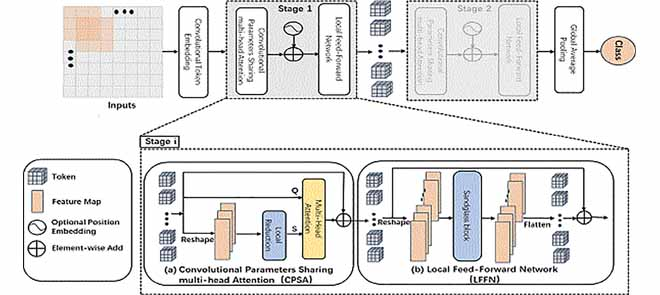

# TSD-Net

This repository is an unofficial PyTorch implementation of the [paper](https://ieeexplore.ieee.org/document/9944625) [1] : "Transformers Meet Small Datasets". TSD-Net is a transformer-CNN hybrid architecture with multiple novel layers including the Convolutional Parameter Sharing Attention(CPSA) Block and  the Local Feed-Forward Network(LFFN) Block. The core idea behind these novelties is to increase the effectiveness of CNNs which excel at capturing local patterns through attention mechanisms that excel at capturing global patterns.

For more details, please refer the [paper](https://ieeexplore.ieee.org/document/9944625).



*Figure 1: Overall architecture of TSD-Net.*

This repo contains code for training the TSD-T(TSD-Tiny) and TSD-B(TSD-Big) variants on the CIFAR-10 Dataset.The training logic can be customized to train on other datasets and the training parameters and the model parameters can be easily modified using the config/config.yaml file.
There is also support for model checkpointing. In order to enable it, the users need only create a checkpoints folder and two subfolders 'latest' and 'best' inside it to store the latest and the best versions of the model, respectively during training.

There is also support to auto-resume training from a checkpoint. You can set 'AUTO_RESUME' to True in the config.yaml file. By default, this auto-resumes training from the model inside checkpoints/latest but this can be tweaked by modifying utils.resume_checkpoint function and tools.train functions.

## Steps

### 1. Clone the repository

```bash
git clone https://github.com/soulsharp/ADTransformer
```

### 2. Install dependencies using pip

Please ensure that PyTorch supports CUDA on your setup and install the requirments in your virtual env.

```bash
pip install -r requirements.txt
```

### 3. Training the model

To train the classification model(TSD-T by default):

#### a. Configure training dataset

In case you wanna train a different model, you can modify the logic inside dataset.py. By default the CIFAR-10 Dataset is trained.

#### b. Configure Training

All training-related parameters can be modified in the config.yaml file.
Important: Do not modify the tsd_params section to avoid breaking the training pipeline.

Make sure that in the config file, train_params["checkpoint_dir] points to the base of the checkpoint directory

#### c. Start Training

Run the following command:

```bash
python -m tools.train
```

## Contributing

Pull requests are welcome. For major changes, please open an issue first
to discuss what you would like to change.

## License

[MIT](https://choosealicense.com/licenses/mit/)

## References

```bash
[1] @ARTICLE{9944625,
   author={Shao, Ran and Bi, Xiao-Jun},
   journal={IEEE Access}, 
   title={Transformers Meet Small Datasets}, 
   year={2022},
   volume={10},
   number={},
   pages={118454-118464},
   keywords={Transformers;Convolutional neural networks;Computational modeling;Computer architecture;Training data;Feature extraction;Data models;Visual analytics;Convolutional neural networks;small datasets;transformer;vision transformer},
   doi={10.1109/ACCESS.2022.3221138}}
```
